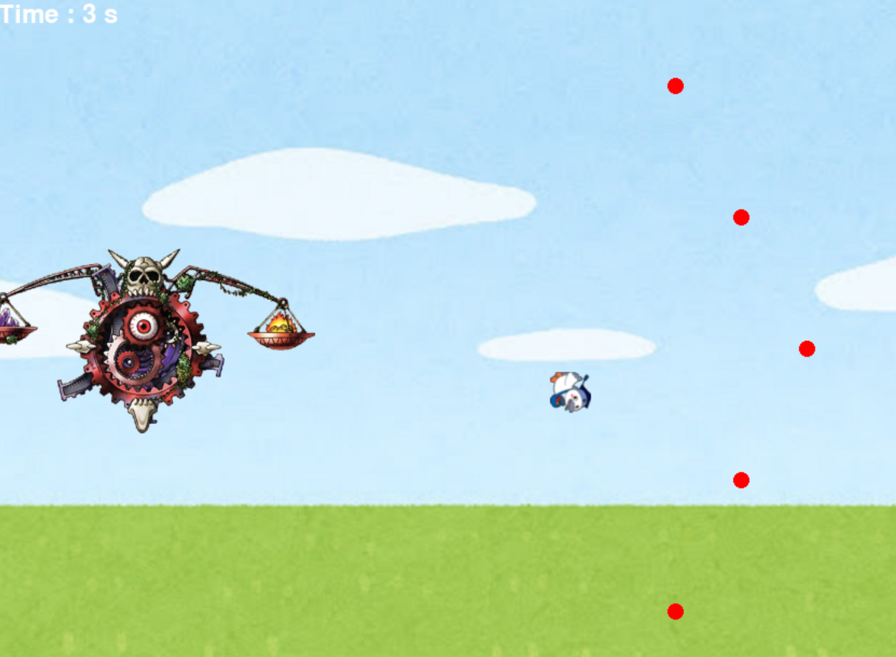

# 弾避けゲーム

## 実行環境の必要条件
* python >= 3.10
* pygame >= 2.1

## ゲームの概要
* こうかとんが限られた範囲で弾を避ける

## ゲームの遊び方
* 矢印キーでこうかとんを操作
* 制限時間内で弾に当たらないように避ける

## ゲームの実装
### 共通基本機能
* 背景画像と主人公キャラクターの描画
* 移動範囲制限
* 敵キャラの位置固定
* 制限時間とスコア

### 分担追加機能
* ステージ1弾幕
画面左側の敵キャラを中心に三日月状に弾幕を数秒おきに発射される。

* ステージ2弾幕
通常の球とレーザービームの二種類が出される。

通常の球は、プレイヤーに追従するようになっており、さらにランダムに決まった範囲で出るようになっているので、よけるのは難しいなってものになっている。
レーザーは敵のカウントダウンに合わせて、出るようになっており、真ん中固定で出されるようになっている。

* ステージ3弾幕　弾幕が無数に飛んできます。頑張ってよけてください
* ステージEX　追尾弾とランダムに地雷があります。　頑張ってよけてください

=======
* ステージ3弾幕
* 弾の生成：

弾を発射する際、弾が追尾対象（プレイヤーや敵）をターゲットに設定する。
発射された弾は、ターゲットに向かって追尾する挙動を持つ。
追尾機能の実装：

弾はターゲットを追尾するため、一定のフレームごとにターゲットの位置を取得し、その方向に向かって移動する。
追尾の強さ（どの程度ターゲットに向かうか）や速度なども調整可能にする。
時間経過での消滅：

弾が生成されたタイミングでタイマーを設定し、一定時間が経過すると自動的に弾を消滅させる。
消滅処理は、メモリ管理や描画のリソースを節約するために重要。

* 制限時間設定
各ステージ制限時間を６０秒に設定。６０秒経過でステージクリアとなり、「N」キーで次のステージに
* 弾避け機能
ステージ開始から２０秒経過で自動的に弾を防ぐバリアを、４０秒経過で一時的に無敵化される。

複数の弾を同時に発射する場合、各弾に個別の追尾処理と消滅タイマーを割り当てる。
全ての弾が独立して追尾と消滅を行うため、ゲームプレイにおいても複数のターゲットを同時に追尾する挙動が実現できる。
* 制限時間設定
各ステージ制限時間を６０秒に設定。６０秒経過でステージクリアとなり、「N」キーで次のステージに
* 弾避け機能
ステージ開始から２０秒経過で自動的に弾を防ぐバリアを、４０秒経過で一時的に無敵化される。

### ToDo
- 円形爆弾の設置
追尾弾
ランダム位置の地雷原

### メモ
* 
